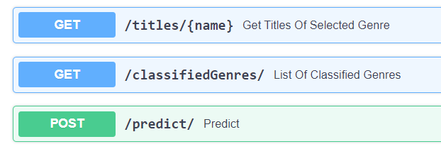
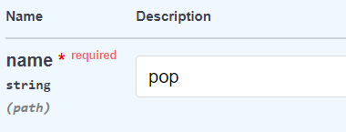
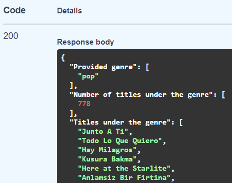
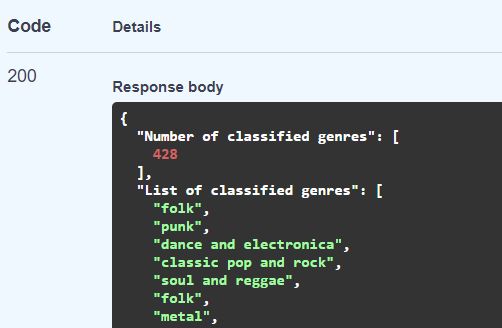
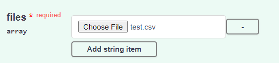
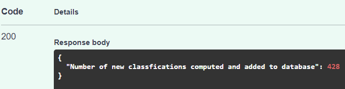

# Music Genre Classification Project

## Project Overview
The objective of this project is to build a classifier to classify music genres of provided music pieces that are stored as structured data. Linear and non-linear machine learning models were explored, and a best model was selected as final classifer based on test performance. Subsequently, a web application utilizing FastAPI and sqlite database is built with the final classifier incorporated, to serve as a lite music genre classifier. The application is also containerized through Docker for maintainability and extendability.

 

## Installation & Requirements
Docker 20.10.7  
Python 3.8.8

pandas==1.2.4 
numpy==1.20.1 
scikit-learn==0.23.2 
uvicorn==0.14.0 
fastapi==0.67.0 
xgboost==1.4.2 
lightgbm==3.2.1 
python-multipart==0.0.5

 

## Usage
In the root directory:  
'app' folder wraps the classifier web application.  
Inside 'app' folder:
* 'models' folder:  contains the final ML model and other related serialized objects for implementing the web service.
* 'tests.py': for unit tests of the web application.
* 'music.db': sqlite database for the web application  

'notebook' folder contains the jupyter notebook for data exploration and modelling experimentation.  
'Dockerfile' is for the containerized web application.  

To run the containerized web application:  
1. Build docker image and run container (port==8000) using 'Dockerfile'.
2. Open the prompted url (i.e. 'http//127.0.0.1:8000').
3. Divert to the homepage of API by adding suffix '/docs' (i.e. '127.0.0.1:8000/docs').
4. 3 functions provided by the web application are displayed:  
5. Function 'Get Titles of Selected Genre' will return a list of song titles that belongs to the provided genre. To use the funtion, a genre name needs to be given as input.   Example of output:   
6. Function 'List of Classified Genres' will show all classified/predicted genres for songs that are already input to and analyzed by the classifier. No user inputs are needed here.  Example of output:   
7. Function 'Predict' will predict the genres of songs provided by the user. The input format should be an external .csv file that will be uploaded to the website (Only single file upload is valid). As illustrated below:   Example of output:   
8. Once 'Predict' function is performed successfully, titles of provided songs and corresponding classified genres will be stored to the database automatically.

